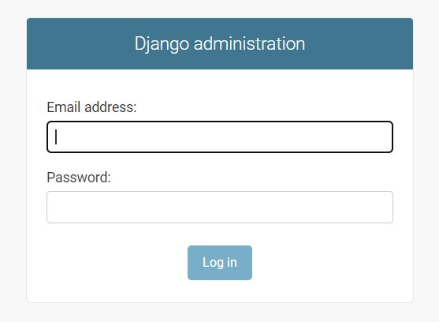
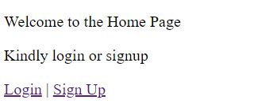
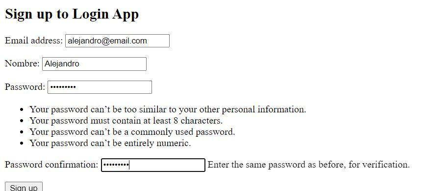
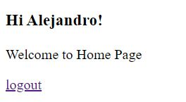

# Custom Authentication

The first step is create the project, in my case the project name is Cus that refers to Custom. Once the project is created now is necesary to create the app, for me is account

The next step is to create the model:

### account/models.py

```python
from django.contrib.auth.models import AbstractUser, BaseUserManager
from django.db import models
from django.utils.translation import gettext_lazy as _


class CustomUserManager(BaseUserManager):
    """Define a model manager for User model with no username field."""

    def _create_user(self, email,nombre ,password=None, **extra_fields):
        """Create and save a User with the given email and password."""
        if not email:
            raise ValueError('The given email must be set')
        email = self.normalize_email(email)
        user = self.model(email=email, nombre=nombre,**extra_fields)
        user.set_password(password)
        user.save(using=self._db)
        return user

    def create_user(self, email, nombre,password=None, **extra_fields):
        extra_fields.setdefault('is_staff', False)
        extra_fields.setdefault('is_superuser', False)
        return self._create_user(email, nombre,password, **extra_fields)

    def create_superuser(self, email, nombre,password=None, **extra_fields):
        """Create and save a SuperUser with the given email and password."""
        extra_fields.setdefault('is_staff', True)
        extra_fields.setdefault('is_superuser', True)

        if extra_fields.get('is_staff') is not True:
            raise ValueError('Superuser must have is_staff=True.')
        if extra_fields.get('is_superuser') is not True:
            raise ValueError('Superuser must have is_superuser=True.')

        return self._create_user(email, nombre,password, **extra_fields)


class CustomUser(AbstractUser):
    username = None
    nombre = models.CharField(max_length=15)
    email = models.EmailField(_('email address'), unique=True)

    USERNAME_FIELD = 'email'
    REQUIRED_FIELDS = ['nombre']

    objects = CustomUserManager()
```

The class CustomUser can have other fields as zip code, I just chose to add the fiel name (nombre in spanish). We add the field nombre to the REQUIRED_FIELDS, that are the necessary fields to create an user.

In the settings.py we add the next lines:

### Cus/settings.py

```python

INSTALLED_APPS = [
    ...
    'account.apps.AccountConfig',
]

AUTH_USER_MODEL = 'account.CustomUser'

```

On admin.py:

### account.admin.py

```python
from django.contrib import admin
from django.contrib.auth import get_user_model

admin.site.register(get_user_model())
```

Now we migrate and create a superuser. If we run the server and acces to the user view we will see the next view:



For modify all the extra fields that could me related to an user, we modify account/admin.py

### account/admin.py

```python
from django.contrib import admin
from django.contrib.auth.admin import UserAdmin
from django.utils.translation import gettext_lazy as _
from django.contrib.auth import get_user_model


class CustomUserAdmin(UserAdmin):
    """Define admin model for custom User model with no username field."""
    fieldsets = (
        (None, {'fields': ('email','password')}),
        (_('Personal info'), {'fields': ('nombre',)}),
        (_('Permissions'), {'fields': ('is_active', 'is_staff', 'is_superuser',
                                       'groups', 'user_permissions')}),
        (_('Important dates'), {'fields': ('last_login', 'date_joined')}),
    )
    add_fieldsets = (
        (None, {
            'classes': ('wide',),
            'fields': ('email','nombre' ,'password1', 'password2'),
        }),
    )
    list_display = ('email', 'nombre', 'is_staff')
    search_fields = ('email', 'nombre')
    ordering = ('email',)


admin.site.register(get_user_model(),CustomUserAdmin)
```

To stylize the project I modify the account/forms.py, account/views.py, account/urls.py , Cus/urls.py and Cus/settings.py. For more information watch the listed codes. 

And now to watch the results!!!!

The view of the home:



If I create a new user:



Now to enter the keys:



