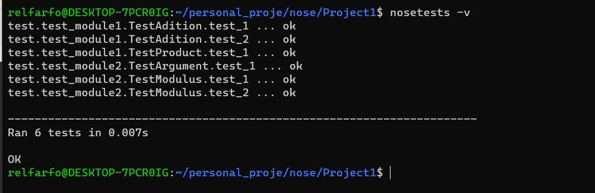

### Test on simple packages

#### Is true that some codes are simplest than others. In this first project I'll show how I prefer test a code that is simple or is in charge of simple tasks.

#### The package "proj" make simple operations for complex numbers, this package have two modules. 

#### The package "test" is in charge of the testing, this package also contains two modules. 

#### The location of the files is show in the image below:

#### The module complex.py contains two functions "adition()" and "prod_esc()" while "module.py" contains the functions "modulus()" and argument(). In the folder proj both modules are available for more details. 

#### For biginig the tests the easiest way is to locate us in the folder where both folder are located, I refer to the "proj" and "test" folders. Once I am on that location the comamand for discover all thetest is "nosetests -v" just tahat the image below. 

