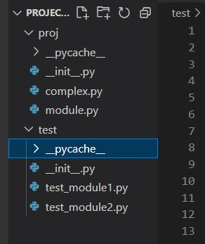

### Testing with nose

##### The principal goal of this project is show hoy use the framework nose for automate the testings tasks. For this I have the package "proj" which is one for work with complex numbers.

##### First, the ubication of the files is the shown in the image below.

